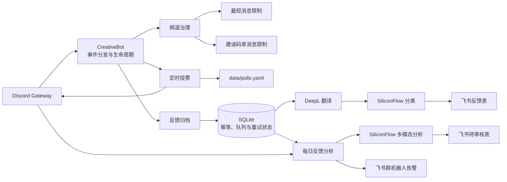

# Fizzy Discord Bot

Fizzy 是一个部署在 Railway 上的常驻 Discord Bot，用于社区频道治理、定时投票、用户反馈归档和 AI 反馈分析。Bot 通过 Discord Gateway 接收事件，只发起出站连接，因此不需要公网域名或 HTTP 服务。

## 功能

- 邀请码频道限制：每位成员只能保留第一条消息，后续消息会被删除并通过私信提醒。
- 最短消息限制：删除指定频道内少于 6 个非空白字符的纯文本消息；附件、嵌入内容、贴纸、投票和转发消息不受影响。
- 定时投票：按照时区和星期配置发布投票，并在投票结束后发布结果汇总。
- 反馈归档：将 Discord 反馈翻译为简体中文并写入飞书多维表格。
- 反馈分类：通过 SiliconFlow 将混合频道消息分类为 `idea`、`bug` 或 `invalid`，分别路由到对应飞书表格。
- 每日反馈分析：聚合同类反馈，生成问题摘要、解决建议和优先级，写入飞书待审核表。
- 失败恢复：外部 API 失败后将任务状态保存到 SQLite，并按照退避策略自动重试。
- 失败告警：每日分析连续失败达到阈值后，通过飞书群机器人 Webhook 发送一次告警。

## 项目架构



核心数据流：

1. Discord 消息首先经过频道治理规则。
2. 符合条件的反馈写入 SQLite，Discord 事件处理不会等待翻译和飞书接口。
3. 后台任务执行翻译、可选分类和飞书写入，并保存每个阶段的结果。
4. 每日分析只读取尚未分析的反馈；历史结果仅以总数、优先级分布和前 20 个分类的聚合摘要传给模型。
5. 模型结果先写入 SQLite，再逐条写入飞书，避免飞书重试时重复调用模型。

## 目录结构

```text
bot/
  main.py             Bot 入口、事件分发和生命周期
  config.py           YAML 配置解析与启动校验
  database.py         SQLite 表结构、幂等和重试状态
  feedback.py         反馈采集、翻译、分类和飞书归档
  analysis.py         每日 AI 分析、图片输入和失败告警
  polls.py            投票功能边界
  scheduler.py        投票发布和结果汇总调度
  content.py          投票内容加载与校验
  invite_code.py      邀请码频道限制
  message_length.py   最短消息限制
config/
  config.railway.yaml 生产配置
  config.test.yaml    临时测试服务器配置
data/
  polls.yaml          投票内容
tests/                自动化测试
Dockerfile            Railway 运行镜像
railway.json          Railway 构建与重启策略
```

## 运行要求

- Python 3.11 或更高版本；生产镜像使用 Python 3.13。
- Discord Bot 已启用 Message Content Intent。
- 启用反馈归档时，需要 DeepL 和飞书开放平台凭据。
- 启用分类或每日分析时，需要支持结构化输出的 SiliconFlow 模型。
- 启用图片分析时，模型还必须支持图片输入。

## 环境变量

| 变量 | 必需条件 | 用途 |
|---|---|---|
| `DISCORD_TOKEN` | 始终必需 | Discord Bot Token |
| `DEEPL_API_KEY` | 启用反馈归档 | DeepL API Key |
| `FEISHU_APP_ID` | 启用反馈归档 | 飞书自建应用 ID |
| `FEISHU_APP_SECRET` | 启用反馈归档 | 飞书自建应用 Secret |
| `SILICONFLOW_API_KEY` | 启用分类或分析 | SiliconFlow API Key |
| `SILICONFLOW_MODEL` | 启用分类或分析 | SiliconFlow 模型名称 |
| `FEISHU_ALERT_WEBHOOK_URL` | 启用每日分析 | 飞书群机器人 Webhook 地址 |
| `BOT_CONFIG_PATH` | 可选 | 配置路径，默认 `config/config.railway.yaml` |
| `LOG_LEVEL` | 可选 | 日志级别，默认 `INFO` |

不要把 Token 或 API Key 写入 YAML 或提交到 Git。生产环境应使用 Railway Variables 保存密钥。

## 配置

生产配置文件包含服务器 ID、频道 ID、飞书应用标识和功能开关，因此 README 不展示其具体内容。配置文件本身不应包含 API Key、Token 或 Webhook URL；这些敏感值必须通过 Railway Variables 注入。

### Discord 与频道治理

Discord 配置包括目标服务器、投票频道、邀请码频道和最短消息限制频道。Bot 需要在相关频道拥有读取历史消息、发送消息和删除消息等对应权限。

### 定时投票

投票配置包括功能开关、时区、发布时间、运行星期、持续时间和内容文件路径。每个自然日最多发布一次投票。发布记录和结束状态保存在 SQLite 中，因此服务重启不会重复发布。投票内容必须包含唯一 `id`、标题、问题和 3–5 个选项。

### 反馈归档

每个 Discord 频道可以写入不同的飞书多维表格。除 `message_time` 必须为日期时间字段、`message_link` 必须为超链接字段外，其余字段使用文本字段。

归档过程不会在 Discord 中回复。以下消息会被忽略：Bot、Webhook、空文本、非普通消息、角色名为 `staff`（不区分大小写）的成员，以及 `excluded_usernames` 中的用户。

`backfill_days` 可设置为 0–30。大于 0 时，Bot 会在首次启动时回填指定天数内的历史消息，并将完成状态持久化到 SQLite。

### 混合频道分类

混合频道会在翻译后调用 SiliconFlow 分类。`idea` 和 `bug` 写入不同表格，`invalid` 只在 SQLite 中保留去重状态，不写飞书。

### 每日反馈分析与告警

飞书分析表需要以下列：`ID`、`Date`、`Category`、`User Feedback`、`Suggested Solution`、`User`、`Priority`、`审核状态`、`来源消息ID`、`来源消息链接` 和 `来源频道ID`。其中 `Date` 为日期时间字段，其余为文本字段。

分析任务按照 `scheduling.timezone` 的本地时间运行。首次运行会分析所有已成功归档且从未进入分析批次的消息，之后只处理新增消息。结果统一以 `审核状态=待审核` 写入飞书。

连续失败达到 `alert_after_attempts` 后，Bot 会通过 `FEISHU_ALERT_WEBHOOK_URL` 向飞书群发送一次告警，并继续自动重试。同一分析批次只告警一次，Webhook 地址必须作为 Railway Variable 保存，不应写入 YAML 或提交到 Git。

## SQLite 持久化与重试

生产数据库路径为 `/data/bot.sqlite3`，Railway 必须将持久化 Volume 挂载到 `/data`。否则重新部署后会丢失任务进度、幂等记录和历史分析状态。

SQLite 保存：

- 投票发布与结果汇总状态；
- 每位成员在邀请码频道的首条消息；
- 反馈翻译、分类、飞书记录 ID 和重试时间；
- 历史回填完成状态；
- 每日分析批次、模型响应、飞书写入进度和告警状态。

外部请求失败后的重试间隔依次为 60、120、240、480、960 秒，之后每 3600 秒重试一次。数据库初始化会自动执行兼容迁移，并清理已经下线的 Prompt 和 `/idea` 功能遗留数据。

## 本地开发

安装项目和开发依赖：

```bash
python -m venv .venv
source .venv/bin/activate
python -m pip install -e '.[dev]'
```

配置环境变量后启动：

```bash
export DISCORD_TOKEN='your-token'
export BOT_CONFIG_PATH='config/config.railway.yaml'
python -m bot.main
```

运行测试和代码检查：

```bash
python -m pytest
python -m ruff check bot tests
```

## Railway 部署

生产部署使用：

- `Dockerfile` 构建 Python 镜像；
- `railway.json` 启用 Dockerfile Builder 和始终重启策略；
- `config/config.railway.yaml` 提供生产配置；
- `/data` Volume 持久化 SQLite；
- Railway Variables 保存密钥。

推送到 GitHub `main` 分支后可触发 Railway 自动部署。Bot 不监听端口，无需配置公开域名。

临时测试服务器可将 Railway 的 `BOT_CONFIG_PATH` 改为 `config/config.test.yaml`。测试结束后应恢复为 `config/config.railway.yaml`。
